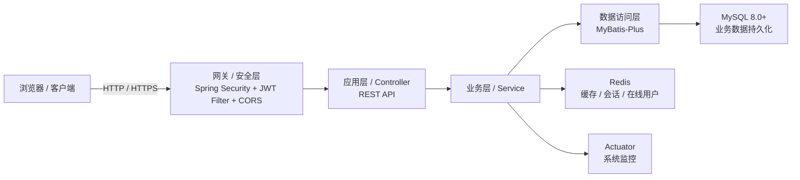

# JOSP-SystemTempleJava

## 项目简介

JOSP-SystemTempleJava 是企业级后台管理系统**后端服务**，基于 Spring Boot 3.4 + MyBatis-Plus + JWT + Redis 构建，提供用户管理、角色权限管理、部门管理、菜单管理、字典管理、系统配置、登录/操作日志、在线用户、系统监控及仪表盘统计等核心能力。项目采用 RBAC 权限模型，通过 Spring Security + JWT 实现无状态认证，MyBatis-Plus 作为 ORM 框架，Redis 承担缓存与会话存储，主键统一使用 Snowflake 雪花 ID，定位为前后端分离架构中的后端 API 服务。

## 系统架构图



## 技术栈

| 分类 | 技术 | 版本 |
|------|------|------|
| 核心框架 | Spring Boot | 3.4.13 |
| Java 版本 | OpenJDK | 25 |
| ORM | MyBatis-Plus | 3.5.16 |
| 数据库 | MySQL | 8.0+ |
| 连接池 | HikariCP | 跟随 Spring Boot |
| 多数据源 | dynamic-datasource | 4.5.0 |
| 缓存 / 会话 | Redis | 跟随 Spring Boot |
| 认证 / Token | Spring Security + JJWT | 0.12.6 |
| API 文档 | Knife4j | 4.5.0 |
| 工具库 | Hutool | 5.8.44 |
| JSON | FastJSON2 | 2.0.61 |
| Excel 处理 | Apache POI | poi 5.2.5 / poi-ooxml 5.4.0 |
| 代码简化 | Lombok | 1.18.44 |
| 格式化 | Spotless + google-java-format | 2.43.0 |

## 项目结构

```
/Users/junw/Documents/GitHub/JOSP-SystemTempleJava/
├── pom.xml                              # Maven 构建配置
├── mvnw / mvnw.cmd                      # Maven Wrapper
├── src/main/java/com/josp/system/
│   ├── JospSystemApplication.java       # 应用入口
│   ├── controller/                      # REST API 控制器
│   ├── service/                         # 业务逻辑接口与实现
│   │   └── impl/                        # Service 实现
│   ├── dao/                             # MyBatis-Plus Mapper 接口
│   ├── entity/                          # 数据库实体
│   ├── dto/                             # 数据传输对象
│   ├── config/                          # Spring / MyBatis-Plus / Redis / CORS 配置
│   ├── security/                        # Spring Security + JWT 认证配置
│   │   ├── config/
│   │   └── jwt/
│   └── common/                          # 公共模块
│       ├── annotation/                  # 操作日志注解
│       ├── aspect/                      # 操作日志 AOP 切面
│       ├── api/                         # 统一响应封装
│       ├── constant/                    # 全局常量
│       ├── exception/                   # 全局异常处理
│       └── utils/                       # 工具类
├── src/main/resources/
│   ├── application.yml                  # 主配置文件
│   ├── banner.txt                       # 启动 Banner
│   └── mapper/                          # XML Mapper
├── src/test/                            # 单元测试（H2 内存数据库）
├── db/
│   ├── database_design.md               # 数据库设计文档
│   └── schema.sql                       # 数据库建表脚本
├── LICENSE                              # AGPL-3.0 开源协议
└── README.md                            # 本文件
```

## 启动方式

### 环境要求

- JDK 25
- Maven 3.8+（或直接使用 `./mvnw`）
- MySQL 8.0+
- Redis 6.0+

### 1. 初始化数据库

```bash
mysql -u root -p
```

```sql
CREATE DATABASE IF NOT EXISTS postgraduate
  DEFAULT CHARACTER SET utf8mb4
  COLLATE utf8mb4_unicode_ci;
USE postgraduate;
SOURCE /Users/junw/Documents/GitHub/JOSP-SystemTempleJava/db/schema.sql;
```

> 默认配置文件中使用的是 `postgraduate` 数据库，可根据需要在 `src/main/resources/application.yml` 中修改。

### 2. 修改应用配置

编辑 `src/main/resources/application.yml`，确认以下连接信息：

- `spring.datasource.dynamic.datasource.master.url`
- `spring.datasource.dynamic.datasource.master.username`
- `spring.datasource.dynamic.datasource.master.password`
- `spring.redis.host`、`spring.redis.port`
- `jwt.secret`（生产环境务必替换）

### 3. 编译并运行

```bash
cd /Users/junw/Documents/GitHub/JOSP-SystemTempleJava

# 编译（跳过测试）
./mvnw compile -DskipTests

# 开发启动
./mvnw spring-boot:run

# 打包
./mvnw package -DskipTests

# 运行 JAR
java -jar target/system-1.0.0-SNAPSHOT.jar
```

服务默认运行在 `http://localhost:8081`，API 文档地址为 `http://localhost:8081/api/v1/doc.html`。

## 开源协议

本项目采用 [GNU Affero General Public License v3.0](https://www.gnu.org/licenses/agpl-3.0.html)（AGPL-3.0）开源协议，详见项目根目录 [LICENSE](LICENSE) 文件。
