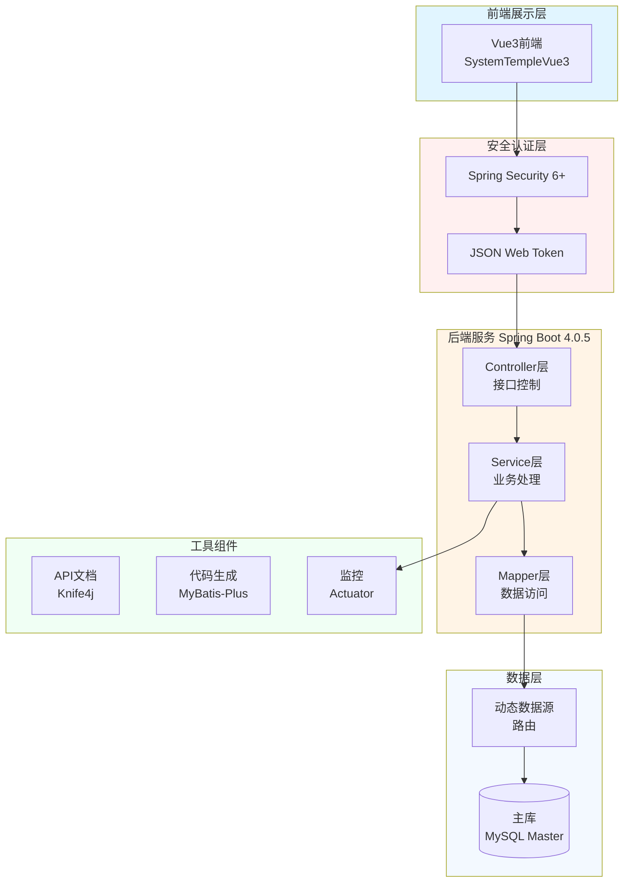

# JOSP-SystemTempleJava


> **Spring Boot 4 后端项目模板** - 现代化、高性能的 Java 后端一键式开发底座。

## 🚀 从模板创建新项目

### 方式1: GitHub 网页操作

1. 点击本页面上方的 **"Use this template"** 按钮
2. 选择 **"Create a new repository"**
3. 填写新项目名称(例如: `JOSP-NewProjectJava`)
4. 点击 **"Create repository"**
5. 克隆新项目到本地:
   ```bash
   git clone https://github.com/你的用户名/JOSP-NewProjectJava.git
   cd JOSP-NewProjectJava
   ```

## 📝 创建后修改项目信息

### 1. 修改 pom.xml

```xml
<artifactId>JOSP-NewProjectJava</artifactId>
<name>JOSP-NewProjectJava</name>
<description>新项目描述</description>
```

### 2. 修改包名

全局搜索替换:
- `com.josp.system` → `你的包名.新项目名`
- `JospSystemApplication` → `新项目启动类名`

### 3. 修改数据库配置

编辑 `src/main/resources/application.yml`:
```yaml
spring:
  datasource:
    dynamic:
      primary: master
      datasource:
        master:
          url: jdbc:mysql://localhost:3306/你的数据库名
          username: 你的用户名
          password: 你的密码
```

## 📖 项目简介

JOSP-SystemTempleJava 是一个基于 Spring Boot 4 和 Java 21 的后端项目模板，提供统一的项目框架结构、API 封装规范、Spring Security + JWT 认证以及 MyBatis-Plus 集成。

**配套前端模板**: 
- Vue3版本: [JOSP-SystemTempleVue3](https://github.com/junwOpenSourceProjects/JOSP-SystemTempleVue3)

## 🏗️ 系统架构



## 🛠️ 技术栈

| 技术 | 版本 | 说明 |
|------|------|------|
| **Spring Boot** | 4.0.5 | 核心框架 |
| **Java** | 21 | 开发语言 |
| **MyBatis-Plus** | 3.5.16 | ORM框架 |
| **MySQL** | 8.0 | 数据库 |
| **Spring Security** | 6.x | 安全框架 |
| **JJWT** | 0.12.6 | JWT处理库 |
| **Knife4j** | 4.5.0 | API文档 (Swagger3) |
| **Hutool** | 5.8.44 | 工具库 |

## 🚀 快速开始

### 环境要求
- JDK 21+
- Maven 3.9+
- MySQL 8.0+

### 运行模板项目

```bash
# 1. 克隆代码
git clone https://github.com/junwOpenSourceProjects/JOSP-SystemTempleJava.git
cd JOSP-SystemTempleJava

# 2. 创建数据库并修改 application.yml 中的连接信息

# 3. 编译并运行
mvn clean spring-boot:run

# 4. 访问服务
# 后端地址: http://localhost:8081
# API文档: http://localhost:8081/doc.html
```

## 📁 项目结构

```
JOSP-SystemTempleJava/
├── src/main/java/
│   └── com/josp/system/
│       ├── controller/          # 控制器层 (/api/v1/...)
│       ├── service/             # 业务逻辑层与 UserDetailsService
│       ├── dao/                 # 数据访问层 (Mapper)
│       ├── entity/              # 实体类 (POJO)
│       ├── security/            # 安全认证 (JWT, Config, Filter)
│       ├── common/              # 通用模块 (Result, Exception)
│       └── JospSystemApplication.java
├── src/main/resources/
│   └── application.yml          # 主配置 (端口 8081)
└── pom.xml
```

## 🔐 安全配置

项目采用 **Spring Security 6** + **JWT** 进行权限控制，默认为无状态认证。
登录接口：`POST /api/v1/auth/login`
认证头：`Authorization: Bearer <token>`

## 📄 许可证

本项目采用 **AGPL-3.0** 许可证 - 详情见 [LICENSE](LICENSE) 文件。
