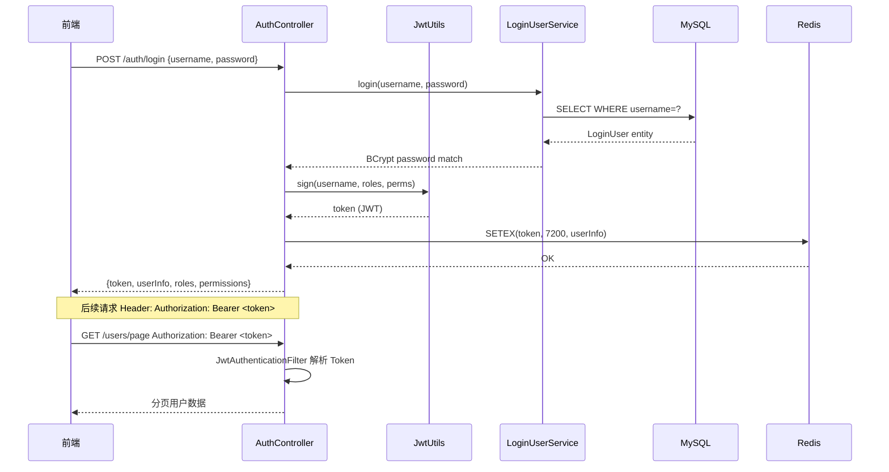
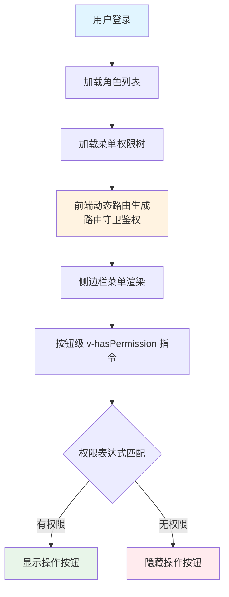

# JOSP-SystemTempleJava

企业级后台管理系统后端，基于 Spring Boot 3.4 + MyBatis-Plus + JWT + Redis，提供用户管理、角色权限管理、部门管理、字典管理、日志管理等核心功能。

## 技术栈

| 分类 | 技术 | 版本 |
|------|------|------|
| 核心框架 | Spring Boot | 3.4.4 LTS |
| Java 版本 | OpenJDK | **25** |
| ORM | MyBatis-Plus | 3.5.10.1 |
| 数据库 | MySQL | 8.0+ (utf8mb4) |
| 缓存 | Redis | 6.0+ |
| 认证 | JWT (jjwt) | 0.12.6 |
| API 文档 | Knife4j | 4.5.0 |
| 工具库 | Hutool | 5.8.28 |
| JSON | Jackson + jackson-datatype-jsr310 | 2.18.x |
| Excel 导出 | Apache POI | 5.4.0 |
| 代码生成 | Lombok | 1.18.40 |

---

## 系统架构

```mermaid
graph TB
    subgraph 前端 "客户端"
        FE["Vue 3 + Vite 8<br/>Pinia + Vue Router<br/>Element Plus + ECharts"]
    end

    subgraph 网关/安全层
        SF["Spring Security<br/>JWT Filter<br/>CORS Config"]
    end

    subgraph 应用层 "Spring Boot 3.4"
        CTRL["16 × Controller<br/>REST API"]
        SV["Service 接口层"]
        SV_IMPL["Service 实现层<br/>@Cacheable 字典缓存"]
    end

    subgraph 数据层
        MP["MyBatis-Plus 3.5<br/>自动填充/Snowflake ID"]
        MYSQL["( MySQL 8.0<br/>15 张业务表 )"]
        REDIS["( Redis 6.0<br/>缓存 + 会话 )"]
    end

    FE -->|"HTTPS / Authorization"| SF
    SF --> CTRL
    CTRL --> SV
    CTRL --> SV_IMPL
    SV_IMPL --> MP
    MP --> MYSQL
    SV_IMPL --> REDIS
    SV_IMPL --> MP

    style FE fill:#e1f5ff,stroke:#1456f0,color:#000
    style SF fill:#f0f0ff,stroke:#6c5ce7,color:#000
    style CTRL fill:#fff3e1,stroke:#f0a020,color:#000
    style SV_IMPL fill:#e8f5e9,stroke:#4caf50,color:#000
    style MYSQL fill:#fff3e1,stroke:#f0a020,color:#000
    style REDIS fill:#fff3e1,stroke:#f0a020,color:#000
```

---

## 项目结构

```
src/main/java/com/josp/system/
├── JospSystemApplication.java          # 应用入口
│
├── controller/                         # REST API（16个）
│   ├── AuthController.java            # 认证：登录 / 登出 / 当前用户信息
│   ├── UserController.java            # 用户管理
│   ├── RoleController.java            # 角色管理
│   ├── MenuController.java            # 菜单管理
│   ├── DeptController.java            # 部门管理（树形）
│   ├── DictController.java            # 字典查询（只读）
│   ├── DictManageController.java      # 字典管理（CRUD）
│   ├── LoginLogController.java        # 登录日志
│   ├── OperLogController.java         # 操作日志
│   ├── NoticeController.java          # 通知公告
│   ├── OnlineUserController.java      # 在线用户管理
│   ├── MonitorController.java         # 系统监控（Server/DB/Redis）
│   ├── DashboardController.java        # 仪表盘统计
│   ├── ConfigController.java          # 系统配置管理
│   └── DemoController.java            # 示例接口
│
├── service/                            # 业务逻辑
│   ├── impl/                          # Service 实现
│   │   ├── OnlineUserServiceImpl.java  # @Profile("!test") — 依赖 Redis
│   │   └── MonitorServiceImpl.java     # @Profile("!test") — 依赖 Redis
│   │   └── ... (其余 Service 实现)
│   └── (接口)
│
├── dao/                               # MyBatis-Plus Mapper
│
├── entity/                            # 数据库实体（Snowflake ID）
│
├── dto/                               # 数据传输对象
│
├── config/                            # Spring 配置
│   ├── CorsConfig.java               # CORS 跨域（生产可用）
│   ├── RedisConfig.java               # Redis + CacheManager（生产）
│   ├── MyMetaObjectHandler.java       # createTime/updateTime 自动填充
│   ├── MybatisPlusConfig.java        # 分页插件 + 逻辑删除
│   └── Knife4jConfig.java            # Swagger 文档配置
│
├── security/                           # 安全认证
│   ├── config/SecurityConfig.java    # Spring Security 配置
│   ├── filter/JwtAuthenticationFilter.java  # JWT 解析 + 认证
│   └── jwt/JwtUtils.java             # Token 签发/验证
│
└── common/                            # 公共模块
    ├── api/CommonResult.java         # 统一响应格式 {code, msg, data}
    ├── api/ResultCode.java           # 状态码枚举
    ├── api/PageResult.java           # 分页响应封装
    ├── api/ServerInfo.java           # 监控：服务器信息
    ├── api/DatabaseInfo.java          # 监控：数据库信息
    ├── api/RedisInfo.java            # 监控：Redis 信息
    ├── annotation/OperLog.java       # 操作日志注解
    ├── aspect/OperLogAspect.java     # 操作日志 AOP 切面
    ├── constant/Constants.java       # 全局常量
    ├── exception/GlobalExceptionHandler.java  # 全局异常处理
    └── utils/IpUtils.java            # IP 归属地解析
```

---

## 数据库设计（15张表）

所有表**不设外键**，通过逻辑关联。字符集 `utf8mb4`，主键全部使用 **Snowflake ID**。

```mermaid
erDiagram
    login_user {
        bigint id PK "雪花算法"
        string username UK
        string nick_name
        string email
        string phone
        int sex
        string avatar
        string password "BCrypt"
        int status
        string dept_id
        bigint create_time
        bigint update_time
    }

    sys_role {
        bigint id PK
        string role_name
        string role_key UK
        int role_sort
        string data_scope
        int status
        bigint create_time
        bigint update_time
    }

    sys_menu {
        bigint id PK
        string menu_name
        int menu_type "M/C/B"
        string path
        string component
        string icon
        int order_num
        bigint parent_id
        string perms
        int status
        bigint create_time
        bigint update_time
    }

    sys_dept {
        bigint id PK
        string dept_name
        int order_num
        bigint parent_id
        string leader
        string phone
        string email
        int status
        bigint create_time
        bigint update_time
    }

    account_role {
        bigint id PK
        bigint user_id FK
        bigint role_id FK
        bigint create_time
    }

    sys_role_menu {
        bigint id PK
        bigint role_id FK
        bigint menu_id FK
    }

    sys_dict_type {
        bigint id PK
        string dict_name
        string dict_code UK
        string description
        int status
        bigint create_time
        bigint update_time
    }

    sys_dict_data {
        bigint id PK
        bigint dict_type_id FK
        string dict_label
        string dict_value
        int dict_sort
        int status
        bigint create_time
        bigint update_time
    }

    sys_post {
        bigint id PK
        string post_name
        string post_code
        int post_sort
        int status
        bigint create_time
        bigint update_time
    }

    sys_oper_log {
        bigint id PK
        string title
        string business_type
        string method
        string request_method
        bigint oper_time
        string oper_name
        string oper_ip
        string oper_location
        string json_result
        int status
        bigint create_time
    }

    sys_login_log {
        bigint id PK
        string username
        int login_type
        string ipaddr
        string login_location
        string user_agent
        string msg
        int status
        bigint login_time
    }

    sys_notice {
        bigint id PK
        string notice_title
        string notice_type
        string notice_content
        string publisher
        int is_top
        int status
        bigint create_time
        bigint update_time
    }

    sys_config {
        bigint id PK
        string config_name
        string config_key UK
        string config_value
        string config_type
        bigint create_time
        bigint update_time
    }

    login_user ||--o{ account_role : "1:N"
    sys_role ||--o{ account_role : "1:N"
    sys_role ||--o{ sys_role_menu : "1:N"
    sys_menu ||--o{ sys_role_menu : "1:N"
    sys_dict_type ||--o{ sys_dict_data : "1:N"
```



---

## API 概览

基础路径：`/api/v1`

### 认证

| 方法 | 路径 | 说明 |
|------|------|------|
| POST | `/auth/login` | 登录，返回 JWT |
| POST | `/auth/logout` | 登出 |
| GET | `/auth/current` | 获取当前用户信息 |

### 系统管理

| 方法 | 路径 | 说明 |
|------|------|------|
| GET | `/users/page` | 分页查询用户 |
| POST | `/users` | 创建用户 |
| PUT | `/users` | 更新用户 |
| DELETE | `/users/{id}` | 删除用户 |
| PUT | `/users/{id}/reset-password` | 重置密码 |
| PUT | `/users/{id}/assign-roles` | 分配角色 |
| GET | `/roles/page` | 分页查询角色 |
| POST | `/roles` | 创建角色 |
| PUT | `/roles` | 更新角色 |
| DELETE | `/roles/{id}` | 删除角色 |
| GET | `/menus/treeselect` | 菜单树形选择器 |
| GET | `/menus/role/{roleId}` | 角色已有菜单 ID 列表 |
| PUT | `/roles/{id}/assign-menus` | 角色分配菜单 |
| GET | `/dept/treeselect` | 部门树形选择器 |
| GET | `/dept/page` | 部门分页查询 |
| GET | `/dept/{id}` | 部门详情 |
| POST | `/depts` | 创建部门 |
| PUT | `/depts` | 更新部门 |
| DELETE | `/depts/{id}` | 删除部门 |

### 字典 & 配置

| 方法 | 路径 | 说明 |
|------|------|------|
| GET | `/dict/types` | 所有字典类型（缓存） |
| GET | `/dict/data/{dictCode}` | 按 code 查询字典数据（缓存） |
| GET | `/dict-manage/types/page` | 分页字典类型 |
| POST | `/dict-manage/types` | 创建字典类型 |
| PUT | `/dict-manage/types` | 更新字典类型 |
| DELETE | `/dict-manage/types/{id}` | 删除字典类型 |
| GET | `/dict-manage/data/page` | 分页字典数据 |
| POST | `/dict-manage/data` | 创建字典数据 |
| PUT | `/dict-manage/data` | 更新字典数据 |
| DELETE | `/dict-manage/data/{id}` | 删除字典数据 |
| GET | `/configs/page` | 分页系统配置 |
| POST | `/configs` | 创建配置 |
| PUT | `/configs` | 更新配置 |
| DELETE | `/configs/{id}` | 删除配置 |

### 日志 & 监控

| 方法 | 路径 | 说明 |
|------|------|------|
| GET | `/login-logs/page` | 分页登录日志 |
| DELETE | `/login-logs/{id}` | 删除登录日志 |
| GET | `/oper-logs/page` | 分页操作日志 |
| DELETE | `/oper-logs/{id}` | 删除操作日志 |
| DELETE | `/oper-logs/clean` | 清空操作日志 |
| GET | `/notices/page` | 分页通知公告 |
| GET | `/notices/{id}` | 公告详情 |
| POST | `/notices` | 创建公告 |
| PUT | `/notices` | 更新公告 |
| DELETE | `/notices/{id}` | 删除公告 |
| PUT | `/notices/{id}/publish` | 发布公告 |
| GET | `/online-users/page` | 分页在线用户 |
| DELETE | `/online-users/{token}` | 强制下线 |
| DELETE | `/online-users/clean` | 清空在线用户 |
| GET | `/monitor/server` | 服务器信息 |
| GET | `/monitor/database` | 数据库信息 |
| GET | `/monitor/redis` | Redis 信息 |
| GET | `/dashboard/stats` | 仪表盘统计数据 |

---

## 统一响应格式

```json
// 成功
{
  "code": 200,
  "msg": "success",
  "data": { ... },
  "timestamp": 1713600000000
}

// 分页
{
  "code": 200,
  "msg": "success",
  "data": {
    "records": [...],
    "total": 100,
    "size": 10,
    "current": 1
  },
  "timestamp": 1713600000000
}
```

| code | 说明 |
|------|------|
| 200 | 成功 |
| 401 | 未认证 / Token 过期 |
| 403 | 无权限 |
| 404 | 资源不存在 |
| 500 | 服务器内部错误 |

---

## 认证流程



---

## 权限模型

采用 **RBAC + 菜单权限** 两层控制：



- **角色权限字符** (`perms`)：格式 `system:user:edit`，对应后端 `@PreAuthorize("hasAuthority('system:user:edit')")`
- **前端指令**：`v-hasPermission="'system:user:edit'"`

---

## 快速开始

### 环境要求

- JDK 25 (LTS)
- Maven 3.8+
- MySQL 8.0+
- Redis 6.0+

### 数据库初始化

```sql
CREATE DATABASE IF NOT EXISTS josp_system DEFAULT CHARACTER SET utf8mb4;
USE josp_system;
SOURCE db/schema.sql;
```

### 配置

编辑 `src/main/resources/application.yml`，确认数据库 / Redis 连接信息。

### 编译运行

```bash
# 编译（跳过测试）
mvn compile -DskipTests

# 启动
mvn spring-boot:run

# 打包
mvn package -DskipTests

# 运行 JAR
java -jar target/josp-system-1.0.0-SNAPSHOT.jar
```

服务启动后访问 `http://localhost:8081/api/v1/doc.html` 查看 Knife4j API 文档。

### 默认账号

| 账号 | 密码 | 角色 |
|------|------|------|
| admin | admin123 | 超级管理员（所有权限） |
| operator | operator123 | 操作员（受限权限） |

---

## 常见问题

**Q: 启动报 Redis 连接失败？**
> 生产环境需要启动 Redis。开发阶段如不需要缓存可将 `spring.redis.enabled: false`，字典查询会走数据库。

**Q: 雪花 ID 生成器集群部署？**
> 默认时间戳从 2024-01-01 开始，多实例部署不会有冲突。如需更高级别保障可引入 MySQL 号段模式。

**Q: 如何新增一个业务模块？**
> 1. 在 `entity/` 创建实体类（继承 `BaseEntity`）
> 2. 在 `dao/` 创建 Mapper 接口（继承 `BaseMapper`）
> 3. 在 `dto/` 创建 DTO 类
> 4. 在 `service/` 创建 Service 接口和实现
> 5. 在 `controller/` 创建 REST Controller
> 6. 在 `db/schema.sql` 末尾追加建表语句

---

## 相关文档

- [SPEC.md](SPEC.md) — 技术规格说明书
- [db/database_design.md](db/database_design.md) — 数据库设计详解
- [db/schema.sql](db/schema.sql) — 数据库建表脚本
