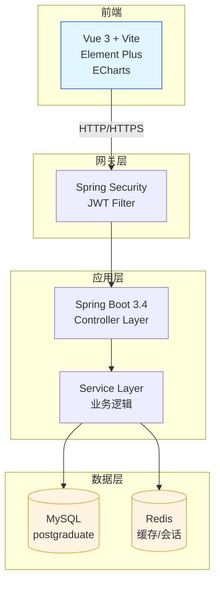
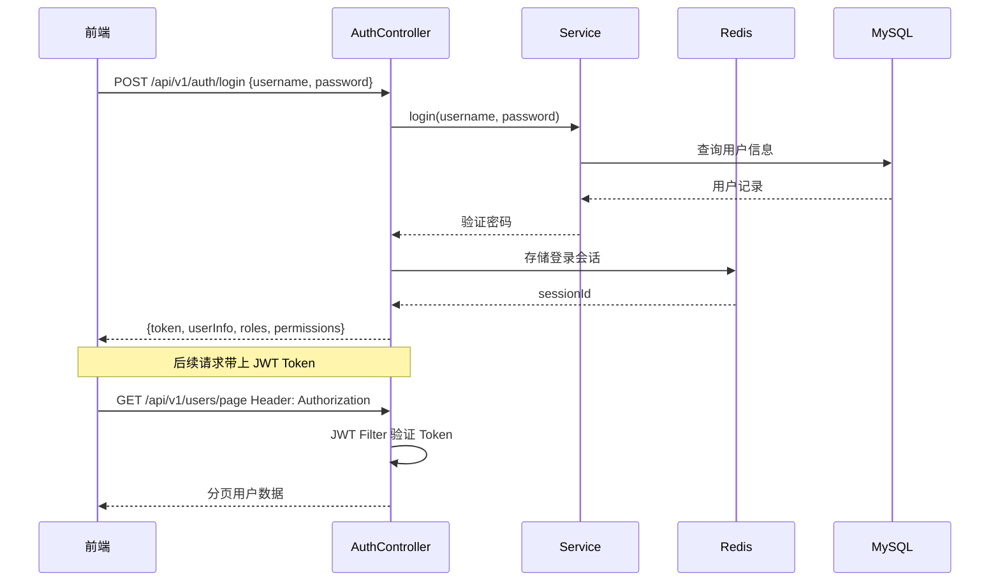
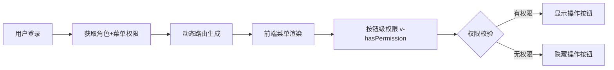

# JOSP-SystemTempleJava

企业级后台管理系统后端服务，基于 Spring Boot 3.4 + MyBatis-Plus，提供用户管理、角色权限管理、部门管理、字典管理、日志管理等核心功能。

## 技术栈

| 分类 | 技术 | 版本 |
|------|------|------|
| 核心框架 | Spring Boot | 3.4.4 |
| Java 版本 | OpenJDK | **25** |
| ORM | MyBatis-Plus | 3.5.10.1 |
| 数据库 | MySQL | 8.0+ |
| 缓存 | Redis | 6.0+ |
| 认证 | JWT (jjwt) | 0.12.6 |
| API 文档 | Knife4j | 4.5.0 |
| 工具库 | Hutool | 5.8.28 |
| JSON | FastJSON2 | 2.0.52 |
| Excel | Apache POI | 5.4.0 |
| 代码生成 | Lombok | 1.18.38 |

## 项目结构

```
src/main/java/com/josp/system/
├── controller/          # REST API 控制器
│   ├── AuthController.java      # 认证（登录/登出/当前用户）
│   ├── UserController.java      # 用户管理
│   ├── RoleController.java      # 角色管理
│   ├── MenuController.java      # 菜单管理
│   ├── DeptController.java      # 部门管理
│   ├── DictController.java      # 字典管理
│   ├── LoginLogController.java  # 登录日志
│   ├── OperLogController.java   # 操作日志
│   ├── NoticeController.java    # 通知公告
│   ├── OnlineUserController.java# 在线用户
│   └── MonitorController.java   # 系统监控
├── service/             # 业务逻辑层
│   └── impl/            # Service 实现
├── dao/                 # 数据访问层（Mapper）
├── entity/              # 数据库实体
├── dto/                 # 数据传输对象
├── config/              # Spring 配置类
├── security/
│   ├── config/          # 安全配置（Spring Security）
│   ├── filter/          # JWT 过滤器
│   └── jwt/             # JWT 工具类
└── common/
    ├── annotation/      # 自定义注解（如 @OperLog）
    ├── aspect/          # AOP 切面
    ├── api/             # API 统一返回格式
    ├── constant/        # 常量定义
    ├── exception/       # 自定义异常
    └── utils/           # 工具类（IP、导出等）
```

## 功能模块

### 核心管理模块

| 模块 | 路径 | 说明 |
|------|------|------|
| 认证 | `/api/v1/auth/*` | 登录、登出、获取当前用户、验证码 |
| 用户 | `/api/v1/users/*` | 分页、创建、更新、删除、重置密码 |
| 角色 | `/api/v1/roles/*` | 分页、创建、更新、删除、分配菜单 |
| 菜单 | `/api/v1/menus/*` | 树形、路由、选项、CRUD |
| 部门 | `/api/v1/dept/*` | 树形、选项、CRUD |

### 系统运维模块

| 模块 | 路径 | 说明 |
|------|------|------|
| 登录日志 | `/api/v1/login-logs/*` | 分页、详情、删除、导出、IP归属地 |
| 操作日志 | `/api/v1/oper-logs/*` | 分页、详情、删除、清空、导出、AOP自动记录 |
| 通知公告 | `/api/v1/notices/*` | CRUD、发布、撤回、置顶 |
| 在线用户 | `/api/v1/online-users/*` | 分页、强制下线、Redis存储 |
| 系统监控 | `/api/v1/monitor/*` | 服务器、数据库、Redis状态 |

## 快速开始

### 环境要求

- JDK 25
- Maven 3.8+
- MySQL 8.0+
- Redis 6.0+

### 数据库初始化

```sql
-- 创建数据库
CREATE DATABASE IF NOT EXISTS postgraduate DEFAULT CHARACTER SET utf8mb4;

-- 执行初始化脚本
source db/schema.sql;
```

### 配置

编辑 `src/main/resources/application.yml`，修改数据库和 Redis 连接信息：

```yaml
spring:
  datasource:
    url: jdbc:mysql://localhost:3306/postgraduate?useUnicode=true&characterEncoding=utf8&serverTimezone=Asia/Shanghai
    username: root
    password: your_password
  redis:
    host: localhost
    port: 6379
```

### 编译运行

```bash
# 编译
mvn compile

# 启动（开发）
mvn spring-boot:run

# 打包
mvn package -DskipTests

# 运行 JAR
java -jar target/josp-system-1.0.0-SNAPSHOT.jar
```

服务启动后访问 `http://localhost:8081/api/v1/doc.html` 查看 Knife4j API 文档。

### 默认账号

| 账号 | 密码 | 角色 |
|------|------|------|
| admin | admin123 | 超级管理员 |

## 数据库设计

核心表结构（15张）：

| 表名 | 说明 |
|------|------|
| `login_user` | 用户表（Snowflake ID） |
| `sys_role` | 角色表 |
| `sys_menu` | 菜单权限表 |
| `sys_dept` | 部门表 |
| `sys_post` | 岗位表 |
| `account_role` | 用户-角色关联表 |
| `sys_role_menu` | 角色-菜单关联表 |
| `sys_dict_type` | 字典类型 |
| `sys_dict_data` | 字典数据 |
| `sys_oper_log` | 操作日志 |
| `sys_login_log` | 登录日志 |
| `sys_notice` | 通知公告 |
| `sys_online_user` | 在线用户（Redis） |
| `sys_config` | 系统配置 |
| `sys_file` | 文件记录表 |

详细设计见 [db/database_design.md](db/database_design.md)

## 系统架构图



## 用户认证流程



## 权限控制流程



## API 统一响应格式

```json
{
  "code": 200,
  "msg": "success",
  "data": { ... },
  "timestamp": 1713600000000
}
```

| code | 说明 |
|------|------|
| 200 | 成功 |
| 401 | 未登录或 Token 过期 |
| 403 | 无权限 |
| 404 | 资源不存在 |
| 500 | 服务器内部错误 |

## 相关资源

- [SPEC.md](SPEC.md) - 技术规格说明书
- [db/database_design.md](db/database_design.md) - 数据库设计文档
- [db/schema.sql](db/schema.sql) - 数据库建表脚本

## 贡献指南

1. Fork 本仓库
2. 创建特性分支 `git checkout -b feat/your-feature`
3. 提交更改 `git commit -m 'feat: add some feature'`
4. 推送到分支 `git push origin feat/your-feature`
5. 创建 Pull Request