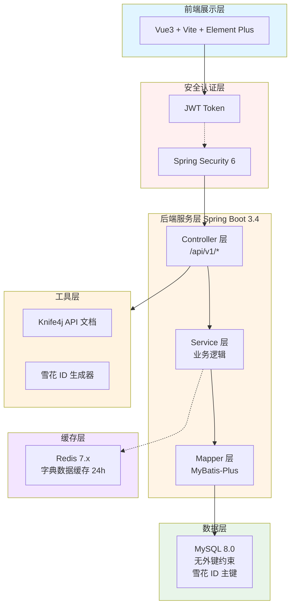
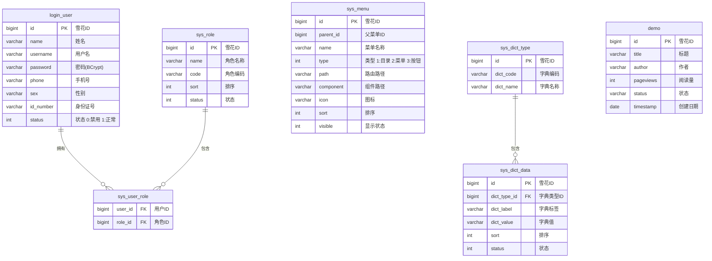

# JOSP-SystemTempleJava


> **JOSP 后端系统模板** - 基于 Spring Boot 3.4 + MyBatis-Plus + Redis 的现代化后端开发底座，支持雪花 ID 生成、动态路由、字典缓存。

---

##配套前端模板

- **Vue3 版本**: [JOSP-SystemTempleVue3](https://github.com/junwOpenSourceProjects/JOSP-SystemTempleVue3)

---

## 系统架构



---

## 核心技术栈

| 技术 | 版本 | 说明 |
|------|------|------|
| Spring Boot | 3.4.4 | 核心框架 |
| Java | 17 | 开发语言 |
| MyBatis-Plus | 3.5.10.1 | ORM 框架 + 雪花 ID |
| MySQL | 8.0 | 关系数据库 |
| Redis | 7.x | 缓存（字典数据） |
| Spring Security | 6.x | 安全框架 |
| JJWT | 0.12.6 | JWT 令牌处理 |
| Knife4j | 4.5.0 | Swagger3 API 文档 |
| Hutool | 5.8.28 | 工具库 |

---

## 核心设计原则

### 1. 雪花 ID 主键

所有表使用 `BIGINT` 主键，通过 MyBatis-Plus 的 `IdentifierGenerator` 接口集成 Hutool 雪花算法，生成全局唯一 19 位 ID。

```java
@TableId(type = IdType.ASSIGN_ID)
private Long id;
```

### 2. 无外键约束

数据库层**不建立外键关联**，通过 Java 代码在 Service 层进行逻辑关联，保证数据库解耦和性能。

### 3. Redis 字典缓存

系统字典数据（用户状态、菜单状态、角色状态、文章状态等）通过 Redis 缓存，TTL 24 小时，减少数据库查询。

---

## 项目结构

```
JOSP-SystemTempleJava/
├── src/main/java/com/josp/system/
│   ├── controller/               # 控制器层
│   │   ├── LoginController.java  # 登录认证
│   │   ├── MenuController.java   # 菜单管理
│   │   ├── DictController.java   # 字典管理
│   │   ├── DemoController.java   # 示例表格（综合表格）
│   │   └── DashboardController.java # 首页数据
│   │
│   ├── service/                  # 业务逻辑层
│   │   ├── LoginUserService.java
│   │   ├── MenuService.java
│   │   ├── DictService.java      # 含 Redis 缓存
│   │   └── impl/
│   │
│   ├── dao/                     # 数据访问层
│   │   ├── LoginUserMapper.java
│   │   ├── MenuMapper.java
│   │   ├── DictTypeMapper.java
│   │   ├── DictDataMapper.java
│   │   └── DemoMapper.java
│   │
│   ├── entity/                   # 实体类
│   │   ├── LoginUser.java
│   │   ├── Menu.java
│   │   ├── Role.java
│   │   ├── AccountRole.java
│   │   ├── DictType.java        # 字典类型
│   │   ├── DictData.java        # 字典数据
│   │   └── Demo.java            # 示例表格
│   │
│   ├── config/                   # 配置类
│   │   ├── SnowflakeIdGenerator.java   # 雪花 ID 生成器
│   │   ├── RedisConfig.java           # Redis + CacheManager
│   │   ├── MybatisPlusConfig.java     # 分页插件
│   │   └── MyMetaObjectHandler.java   # 自动填充
│   │
│   ├── security/                 # 安全认证
│   │   ├── config/SecurityConfig.java
│   │   ├── filter/JwtAuthenticationFilter.java
│   │   └── handling/JwtAuthenticationEntryPoint.java
│   │
│   └── common/                   # 通用模块
│       ├── api/Result.java       # 统一响应封装
│       ├── api/PageResult.java   # 分页结果
│       └── exception/            # 异常处理
│
├── src/main/resources/
│   ├── application.yml           # 主配置
│   └── mapper/                   # XML 映射文件
│
├── db/
│   └── schema.sql                # 数据库初始化脚本
│
└── pom.xml
```

---

## 数据库表结构



---

## API 接口

### 认证接口

| 方法 | 路径 | 说明 |
|------|------|------|
| POST | `/api/v1/auth/login` | 用户登录 |

### 菜单接口

| 方法 | 路径 | 说明 |
|------|------|------|
| GET | `/api/v1/menus/routes` | 获取用户路由菜单 |
| GET | `/api/v1/menus/all` | 获取所有菜单（树形） |

### 字典接口

| 方法 | 路径 | 说明 |
|------|------|------|
| GET | `/api/v1/dict/types` | 获取所有字典类型 |
| GET | `/api/v1/dict/data/{dictCode}` | 根据编码获取字典数据 |
| GET | `/api/v1/dict/data/type/{dictTypeId}` | 根据类型ID获取 |
| GET | `/api/v1/dict/data/all` | 获取所有字典数据分组 |

### 示例接口

| 方法 | 路径 | 说明 |
|------|------|------|
| GET | `/api/v1/demo/table/list` | 获取表格列表（分页+搜索） |
| GET | `/api/v1/demo/table/{id}` | 获取单条记录 |
| POST | `/api/v1/demo/table` | 新增记录 |
| PUT | `/api/v1/demo/table/{id}` | 更新记录 |
| DELETE | `/api/v1/demo/table/{id}` | 删除记录 |

---

## 快速开始

### 环境要求

- JDK 17+
- Maven 3.9+
- MySQL 8.0+
- Redis 7.x

### 启动步骤

```bash
# 1. 克隆项目
git clone https://github.com/junwOpenSourceProjects/JOSP-SystemTempleJava.git
cd JOSP-SystemTempleJava

# 2. 初始化数据库
mysql -u root -p < db/schema.sql

# 3. 修改数据库/Redis 配置
# 编辑 src/main/resources/application.yml

# 4. 编译运行
mvn clean spring-boot:run

# 5. 访问地址
#   - 后端服务: http://localhost:8081
#   - API 文档: http://localhost:8081/doc.html
```

---

## 默认账号

| 用户名 | 密码 | 角色 |
|--------|------|------|
| admin | 123456 | 超级管理员 |
| test_male | 123456 | 系统管理员 |
| test_female | 123456 | 普通用户 |

---

## 许可证

本项目采用 **AGPL-3.0** 许可证 - 详情见 [LICENSE](LICENSE) 文件。
