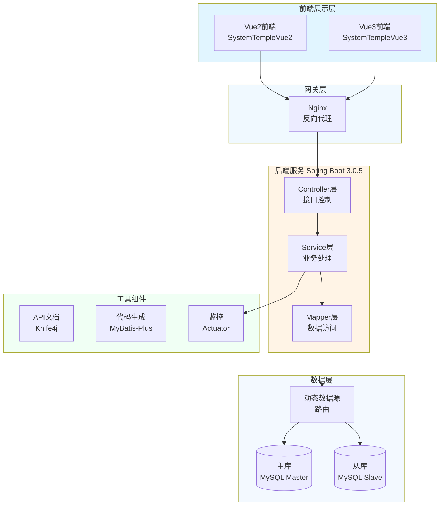

# JOSP-SystemTempleJava - 系统模板项目


> 用于快速构建后台系统的Spring Boot模板项目

## 📖 项目简介

JOSP-SystemTempleJava 是一个用于快速构建后台管理系统的 Spring Boot 模板项目,提供了完整的项目结构、常用功能模块和最佳实践,支持多数据源配置,可快速启动新的后台系统开发。

**前端项目**: 
- Vue2版本: [JOSP-SystemTempleVue2](../JOSP-SystemTempleVue2)
- Vue3版本: [JOSP-SystemTempleVue3](../JOSP-SystemTempleVue3)

## 🏗️ 系统架构



## 🛠️ 技术栈

| 技术 | 版本 | 说明 |
|------|------|------|
| **Spring Boot** | 3.0.5 | 核心框架 |
| **Java** | 17 | 开发语言 |
| **MyBatis-Plus** | 3.5.7 | ORM框架 |
| **MySQL** | 8.0.32 | 数据库 |
| **Knife4j** | 3.0.3 | API文档 |
| **Hutool** | 5.8.21 | 工具库 |
| **Dynamic Datasource** | 3.5.0 | 多数据源 |
| **Velocity** | 2.3 | 模板引擎 |

## 📦 核心依赖

### Web层
- `spring-boot-starter-web` - Web开发
- `spring-boot-starter-webflux` - 响应式Web
- `spring-boot-starter-web-services` - Web服务

### 数据层
- `mybatis-plus-spring-boot3-starter` - MyBatis增强
- `dynamic-datasource-spring-boot-starter` - 多数据源
- `mybatis-plus-generator` - 代码生成器

### 工具层
- `lombok` - 简化代码
- `hutool-all` - 工具集
- `fastjson2` - JSON处理

### 监控层
- `spring-boot-starter-actuator` - 应用监控

## 🚀 快速开始

### 环境要求
- JDK 17+
- Maven 3.6+
- MySQL 8.0+

### 安装步骤

1. **克隆项目**
```bash
git clone https://github.com/your-username/JOSP-SystemTempleJava.git
cd JOSP-SystemTempleJava
```

2. **配置数据库**
```bash
# 创建数据库
CREATE DATABASE system_template;

# 导入SQL脚本
mysql -u root -p system_template < db/schema.sql
```

3. **修改配置**
```yaml
# application.yml
spring:
  datasource:
    dynamic:
      primary: master
      datasource:
        master:
          url: jdbc:mysql://localhost:3306/system_template
          username: root
          password: your_password
```

4. **运行项目**
```bash
mvn clean install
mvn spring-boot:run
```

5. **访问服务**
- 后端地址: http://localhost:8088
- API文档: http://localhost:8088/doc.html
- 健康检查: http://localhost:8088/actuator/health

## 📁 项目结构

```
JOSP-SystemTempleJava/
├── src/main/java/
│   └── wo1261931780/
│       ├── controller/          # 控制器层
│       │   ├── system/          # 系统管理
│       │   └── common/          # 通用接口
│       ├── service/             # 业务逻辑层
│       │   ├── system/          # 系统服务
│       │   └── impl/            # 服务实现
│       ├── mapper/              # 数据访问层
│       ├── entity/              # 实体类
│       ├── config/              # 配置类
│       │   ├── DataSourceConfig.java
│       │   ├── MybatisPlusConfig.java
│       │   └── WebConfig.java
│       ├── common/              # 通用模块
│       │   ├── Result.java      # 统一返回
│       │   ├── PageResult.java  # 分页结果
│       │   └── Constants.java   # 常量定义
│       └── utils/               # 工具类
├── src/main/resources/
│   ├── application.yml          # 主配置
│   ├── application-dev.yml      # 开发环境
│   ├── application-prod.yml     # 生产环境
│   └── mapper/                  # MyBatis映射
└── pom.xml
```

## 🔧 核心功能

### 1. 多数据源配置
```yaml
spring:
  datasource:
    dynamic:
      primary: master
      strict: false
      datasource:
        master:
          url: jdbc:mysql://localhost:3306/master_db
          username: root
          password: password
        slave:
          url: jdbc:mysql://localhost:3306/slave_db
          username: root
          password: password
```

### 2. 统一返回格式
```java
public class Result<T> {
    private Integer code;
    private String message;
    private T data;
    
    public static <T> Result<T> success(T data) {
        return new Result<>(200, "success", data);
    }
    
    public static Result<?> error(String message) {
        return new Result<>(500, message, null);
    }
}
```

### 3. 分页查询
```java
@GetMapping("/page")
public Result<PageResult<User>> page(
    @RequestParam(defaultValue = "1") Integer pageNum,
    @RequestParam(defaultValue = "10") Integer pageSize
) {
    Page<User> page = userService.page(
        new Page<>(pageNum, pageSize)
    );
    return Result.success(PageResult.of(page));
}
```

### 4. 代码生成器
```java
// 自动生成Entity、Mapper、Service、Controller
FastAutoGenerator.create("jdbc:mysql://localhost:3306/db", "root", "password")
    .globalConfig(builder -> builder.author("junw"))
    .packageConfig(builder -> builder.parent("wo1261931780"))
    .strategyConfig(builder -> builder
        .addInclude("user")  // 表名
        .entityBuilder()
        .mapperBuilder()
        .serviceBuilder()
        .controllerBuilder()
    )
    .execute();
```

## 📊 系统功能模块

### 基础模块
- ✅ 用户管理
- ✅ 角色管理
- ✅ 权限管理
- ✅ 菜单管理
- ✅ 日志管理
- ✅ 字典管理

### 系统监控
- ✅ 在线用户
- ✅ 服务监控
- ✅ 缓存监控
- ✅ SQL监控

## 🔌 API文档

启动项目后访问 Knife4j 接口文档:
- 地址: http://localhost:8088/doc.html
- 功能: 
  - 在线接口测试
  - API文档查看
  - 接口分组管理

## 🔐 安全配置

### 跨域配置
```java
@Configuration
public class WebConfig implements WebMvcConfigurer {
    @Override
    public void addCorsMappings(CorsRegistry registry) {
        registry.addMapping("/**")
            .allowedOrigins("*")
            .allowedMethods("GET", "POST", "PUT", "DELETE")
            .allowedHeaders("*");
    }
}
```

### 参数校验
```java
@PostMapping("/save")
public Result<?> save(@Valid @RequestBody UserDTO dto) {
    // 自动参数校验
    userService.save(dto);
    return Result.success();
}
```

## 📝 开发指南

### 新增模块
1. 创建Entity实体类
2. 创建Mapper接口
3. 创建Service接口和实现
4. 创建Controller控制器
5. 编写API文档

### 多环境配置
```bash
# 开发环境
mvn spring-boot:run -Dspring.profiles.active=dev

# 生产环境
mvn clean package -Pprod
```

## 📈 性能优化

### 数据库优化
- 合理使用索引
- 开启查询缓存
- 读写分离配置

### 连接池优化
```yaml
spring:
  datasource:
    hikari:
      maximum-pool-size: 20
      minimum-idle: 5
      connection-timeout: 30000
```

### 缓存策略
```java
@Cacheable(value = "user", key = "#id")
public User getById(Long id) {
    return userMapper.selectById(id);
}
```

## 📝 更新日志

### v0.0.1-SNAPSHOT
- 初始化项目结构
- 集成Spring Boot 3.0.5
- 配置多数据源支持
- 添加代码生成器
- 集成Knife4j文档
- 添加系统监控功能

## 🤝 贡献指南

欢迎提交 Issue 和 Pull Request!

## 📄 许可证

本项目采用 MIT 许可证 - 查看 [LICENSE](LICENSE) 文件了解详情

## 📮 联系方式

- 作者: junw
- Email: wo1261931780@gmail.com
- GitHub: [@wo1261931780](https://github.com/wo1261931780)

## 🙏 致谢

感谢 Spring Boot、MyBatis-Plus 等开源项目的支持!

---

**提示**: 本项目作为系统模板,提供了完整的后台系统基础功能。建议根据实际业务需求调整和扩展功能模块。
