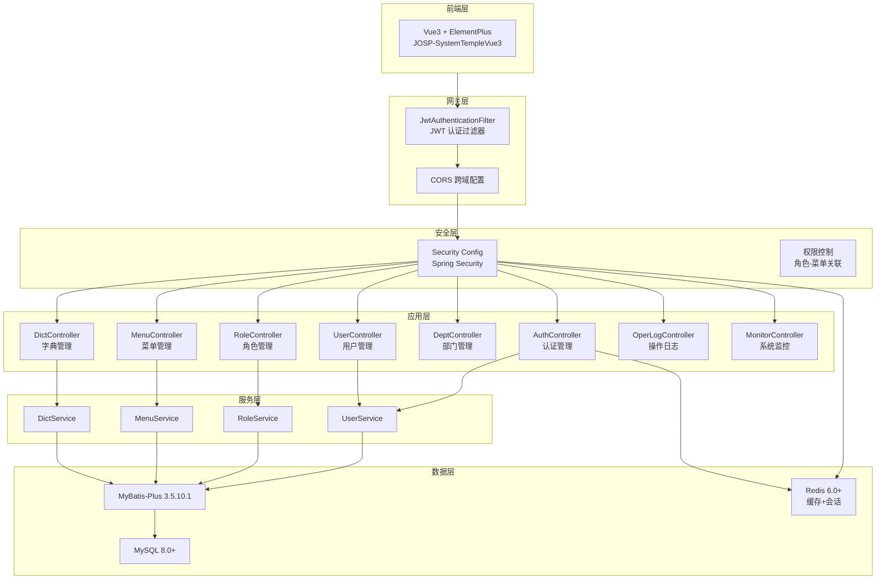
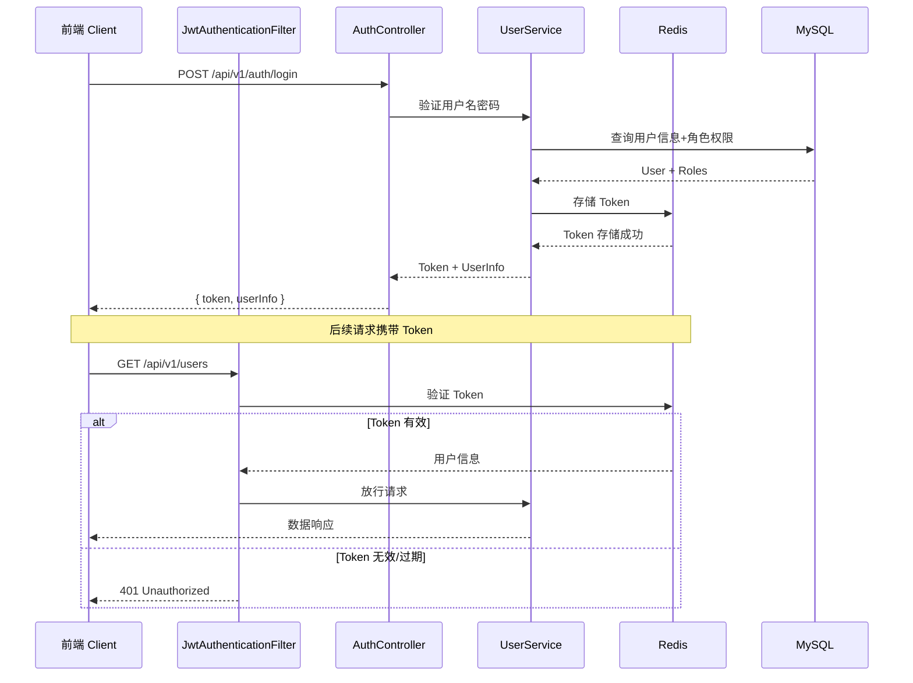
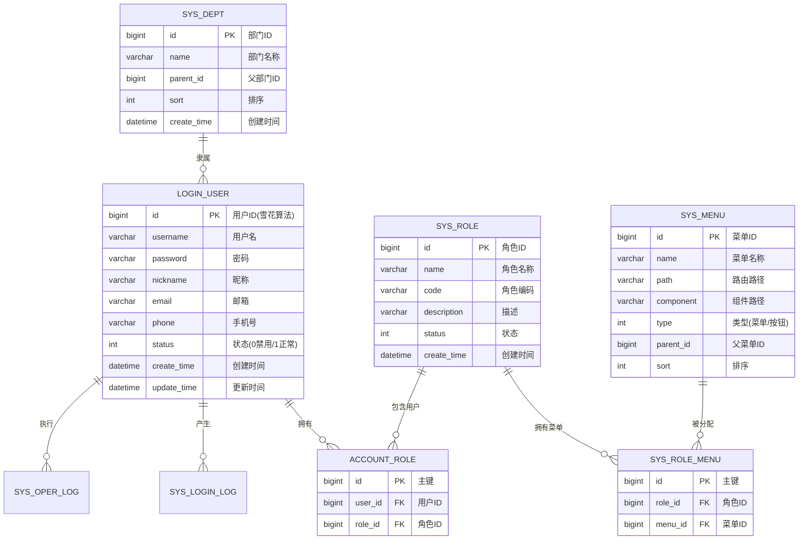

# JOSP-SystemTempleJava 技术规格说明书

## 1. 项目概述

| 属性 | 内容 |
|------|------|
| 项目名称 | JOSP-SystemTempleJava |
| 项目类型 | 企业级后台管理系统后端服务 |
| 核心功能 | 用户管理、角色权限管理、部门管理、字典管理、日志管理等 |
| 技术架构 | Spring Boot 3.4 + MyBatis-Plus + JWT + Redis |
| 源代码规模 | 111 个 Java 文件 |

## 2. 技术栈

| 分类 | 技术 | 版本 |
|------|------|------|
| 核心框架 | Spring Boot | 3.4.4 |
| Java 版本 | OpenJDK | 25 |
| ORM | MyBatis-Plus | 3.5.10.1 |
| 数据库 | MySQL | 8.0+ |
| 缓存 | Redis | 6.0+ |
| 认证 | JWT (jjwt) | 0.12.6 |
| API 文档 | Knife4j | 4.5.0 |
| 工具库 | Hutool | 5.8.28 |
| JSON | FastJSON2 | 2.0.52 |
| Excel 处理 | Apache POI | 5.4.0 |
| 代码生成 | Lombok | 1.18.38 |

## 3. 项目结构

```
src/main/java/com/josp/system/
├── controller/          # REST API 控制器
│   ├── AuthController.java      # 认证（登录/登出/当前用户）
│   ├── UserController.java      # 用户管理
│   ├── RoleController.java      # 角色管理
│   ├── MenuController.java      # 菜单管理
│   ├── DeptController.java      # 部门管理
│   ├── DictController.java      # 字典管理
│   ├── LoginLogController.java  # 登录日志
│   ├── OperLogController.java   # 操作日志
│   ├── NoticeController.java    # 通知公告
│   ├── OnlineUserController.java# 在线用户
│   └── MonitorController.java   # 系统监控
├── service/             # 业务逻辑层
│   └── impl/            # Service 实现
├── dao/                 # 数据访问层（Mapper）
├── entity/              # 数据库实体
├── dto/                 # 数据传输对象
├── config/              # Spring 配置类
├── security/
│   ├── config/          # 安全配置（Spring Security）
│   ├── filter/          # JWT 过滤器
│   └── jwt/             # JWT 工具类
└── common/
    ├── annotation/      # 自定义注解（如 @OperLog）
    ├── aspect/          # AOP 切面
    ├── api/             # API 统一返回格式
    ├── constant/        # 常量定义
    ├── exception/       # 自定义异常
    └── utils/           # 工具类（IP、导出等）
```

---

## 4. 架构设计

### 4.1 系统架构图



### 4.2 JWT 认证流程



### 4.3 数据库 ER 图（核心实体）



---

## 5. 数据库设计

### 5.1 核心表（15张）

| 表名 | 说明 |
|------|------|
| `login_user` | 用户表（Snowflake ID） |
| `sys_role` | 角色表 |
| `sys_menu` | 菜单权限表 |
| `sys_dept` | 部门表 |
| `sys_post` | 岗位表 |
| `account_role` | 用户-角色关联表 |
| `sys_role_menu` | 角色-菜单关联表 |
| `sys_dict_type` | 字典类型 |
| `sys_dict_data` | 字典数据 |
| `sys_oper_log` | 操作日志 |
| `sys_login_log` | 登录日志 |
| `sys_notice` | 通知公告 |
| `sys_online_user` | 在线用户（Redis） |
| `sys_config` | 系统配置 |
| `sys_file` | 文件记录表 |

### 5.2 设计原则

- **雪花ID主键**: 所有表使用 `IdType.ASSIGN_ID` 生成19位雪花ID
- **无外键设计**: 不使用数据库外键约束，在业务层逻辑关联
- **逻辑删除**: 状态字段代替物理删除
- **统一审计字段**: create_time, update_time, create_user, update_user

详细设计见 [db/database_design.md](db/database_design.md)

## 6. API 路由

### 6.1 核心管理模块

| 模块 | 路径 | 说明 |
|------|------|------|
| 认证 | `/api/v1/auth/*` | 登录、登出、获取当前用户、验证码 |
| 用户 | `/api/v1/users/*` | 分页、创建、更新、删除、重置密码 |
| 角色 | `/api/v1/roles/*` | 分页、创建、更新、删除、分配菜单 |
| 菜单 | `/api/v1/menus/*` | 树形、路由、选项、CRUD |
| 部门 | `/api/v1/dept/*` | 树形、选项、CRUD |
| 字典 | `/api/v1/dict/*` | 类型CRUD、数据CRUD |

### 6.2 系统运维模块

| 模块 | 路径 | 说明 |
|------|------|------|
| 登录日志 | `/api/v1/login-logs/*` | 分页、详情、删除、导出、IP归属地 |
| 操作日志 | `/api/v1/oper-logs/*` | 分页、详情、删除、清空、导出、AOP自动记录 |
| 通知公告 | `/api/v1/notices/*` | CRUD、发布、撤回、置顶 |
| 在线用户 | `/api/v1/online-users/*` | 分页、强制下线、Redis存储 |
| 系统监控 | `/api/v1/monitor/*` | 服务器、数据库、Redis状态 |

## 7. API 统一响应格式

```json
{
  "code": 200,
  "msg": "success",
  "data": { ... },
  "timestamp": 1713600000000
}
```

| code | 说明 |
|------|------|
| 200 | 成功 |
| 401 | 未登录或 Token 过期 |
| 403 | 无权限 |
| 404 | 资源不存在 |
| 500 | 服务器内部错误 |

## 8. 认证流程

1. 用户登录 → AuthController.login()
2. 验证用户名密码，查询用户信息和角色权限
3. 生成 JWT Token，存储到 Redis
4. 返回 Token 和用户信息给前端
5. 后续请求带 Authorization Header
6. JwtAuthenticationFilter 拦截验证 Token

## 9. 权限控制

- 基于 Spring Security + JWT
- 角色-菜单多对多关联
- 按钮级权限标识（perm 字段）
- Redis 存储在线用户会话

## 10. 环境要求

- JDK 25
- Maven 3.8+
- MySQL 8.0+
- Redis 6.0+

## 11. 快速开始

```bash
# 编译
mvn compile

# 启动
mvn spring-boot:run

# 打包
mvn package -DskipTests

# 运行
java -jar target/josp-system-1.0.0-SNAPSHOT.jar
```

服务启动后访问 `http://localhost:8081/api/v1/doc.html` 查看 Knife4j API 文档。

默认账号: admin / admin123

## 12. 版本历史

| 版本 | 日期 | 变更说明 |
|------|------|----------|
| 1.0.0 | 2026-04-21 | 初始版本 |
| 1.1.0 | 2026-04-22 | 升级 JDK 17→25，poi-ooxml 5.2.5→5.4.0，完善文档 |